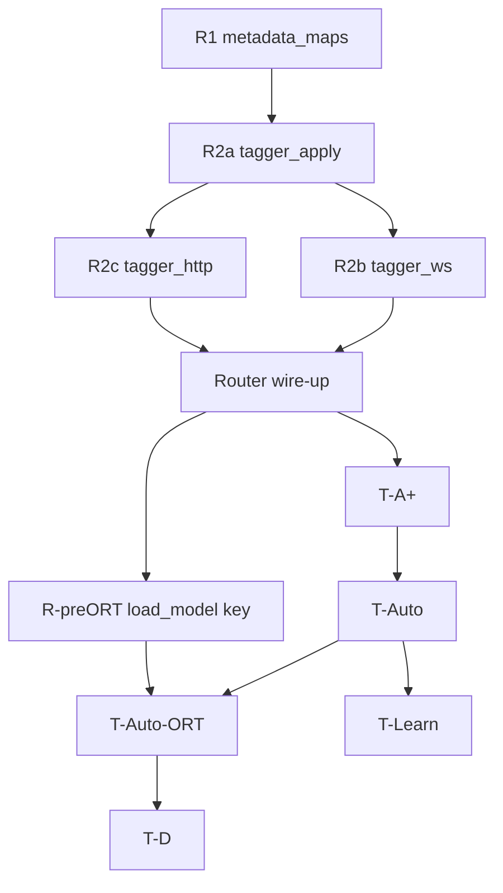

# Upgrade plan v2 — refactoring, code health, and automatic performance tuning

This document turns **`docs/health.md`** and **`docs/TUNING_MODE_UPGRADE_PLAN.md`** into a **sequenced, shippable plan**: what to build, how it maps to the current tree, risks, **UI**, and **test/operations** work. It supersedes ad-hoc execution order but does not replace **`docs/UPGRADE.md`** (dependency/release notes) — add a short pointer there when a milestone ships.

**Product stance:** The user should be able to **enable Tag all with performance auto-tuning**, optionally set **safe bounds** once, and let the run proceed while the program **experiments within those bounds** and **converges** using statistics collected continuously during execution — not a workflow that depends on manual copy-paste of config patches as the primary path.

**Implementation index (quick):** Supervision + WebSocket fields **§4.0–§4.1**; algorithm **§4.2**; refactor order **§10**; UI **§7.1**; regression tests **§16 B.4–B.5**; rollout defaults **§11**; remaining gaps **§14.1**. **Live execution status:** **Implementation** section at the end of this document.

---

## 0. Current baseline (important)

### 0.1 Already implemented vs. the original tuning estimate

**`docs/TUNING_MODE_UPGRADE_PLAN.md`** was written when **Tier A was not implemented**. The tree today already includes a **Tag all–only performance overlay**:

| Item | Status |
|------|--------|
| WebSocket flag `performance_tuning` (ignored unless `tag_all`) | Implemented (`backend/routes/tagger.py`, tests in `tests/test_tagger_websocket.py`) |
| Per-batch **fetch / predict** times from `tag_files` (`batch_metrics_out`) | Implemented (`backend/services/tagging_service.py`) |
| Per-batch **Hydrus apply** wall time in progress payload | Implemented (`hydrus_apply_batch_s` path in `tagger.py`) |
| UI one-line summary (`#progress-perf-tuning`, `formatPerfTuningSummary`) | Implemented (`frontend/js/components/tagger.js`) |
| Docs | `docs/PERFORMANCE_AND_TUNING.md` |

**Gap vs. full vision:** rolling **history**, **structured end-of-run report**, **bounded automatic exploration** of `batch_size` / `hydrus_download_parallel` (and optionally **ORT threads** with reloads — **§4.4**), **supervision modes** (**§4.0** — supervised vs **I’m feeling lucky**), and a **UI** that exposes bounds + live state (“warming up”, “exploring”, “reloading model”, “holding at …”, “awaiting your approval”) are **not** fully there — the UI is mostly **last-batch** oriented.

**Conclusion:** Phase **T-A+** below is **observability + statistics feed** for the auto-tuner; **T-Auto** is the **primary** performance feature (bounded experimentation on a Tag all session). **§5 (T-Learn)** adds an optional **learning prefix** where **Hydrus writes are deferred** so tuning is not confounded by **`add_tags`** latency — without skipping batches or leaving files untagged at the end.

**Resolved contract — `performance_tuning` vs `session_auto_tune`:** **`performance_tuning`** only controls whether **rich per-batch metrics** (and later **history** / **`tuning_state`**) are attached to **`progress`**; it does **not** turn knobs. **`session_auto_tune`** enables **knob exploration** inside bounds. Implementation rule: **`session_auto_tune: true` implies metrics are needed** — if the client sends **`session_auto_tune`** without **`performance_tuning`**, the server **sets `performance_tuning` effective true** for the session (log at DEBUG). Clients may still send both explicitly. **`performance_tuning` alone** never enables auto-tune.

### 0.2 Health recommendations still open

From **`docs/health.md`**: split **`backend/routes/tagger.py`**, centralize **metadata row → `dict[int, dict]`** helpers, gradual **coverage** lift on tagger routes, **singleton** discipline in tests. **`perf_metrics.py`** / **`import sys`** is already fixed. **CORS** is **out of scope** for this plan (no work item here).

---

## 1. Goals (prioritized)

1. **Maintainability:** Smaller modules, shared Hydrus metadata helpers, easier reviews.
2. **Automatic performance tuning (primary):** On **Tag all**, optional **session auto-tune** that:
   - Uses **continuous metrics** (per-batch fetch / predict / apply times, throughput estimates, optional rolling variance).
   - **Explores** candidate knobs **inside user- or default-bounded ranges** at session start: at minimum **`(batch_size, hydrus_download_parallel)`**; optionally **ORT `cpu_intra_op_threads` / `cpu_inter_op_threads`** when the user opts in (**§4.1**, **§4.4** — requires model reload between experiments).
   - Offers **supervised** (step approvals via **`tuning_ack`**) vs fully automated **I’m feeling lucky** before the run starts (**§4.0**).
   - **Converges** toward better throughput using explicit rules (e.g. phased exploration → hold best with hysteresis) documented in code and user docs.
3. **Observability (feeds auto-tune + power users):** Rolling history, end-of-run **`tuning_report`**, optional coarse RSS samples — always aligned with WebSocket batch boundaries to keep overhead **O(1)** per batch.
4. **Transparency:** Each **`progress`** (or parallel message) can include **`tuning_state`** (phase, current knobs, running best, samples in window) so the UI explains *what* the program is doing without requiring manual config editing.
5. **Diagnostics (Tier D):** Opt-in ORT session profiling — **env or explicit diagnostic flag**, never default for Tag all.
6. **Optional learning-phase calibration (§5):** **Configurable fraction** of the queue (by **count** or **bytes**) processed in **Phase L** with **inference only** (results cached); **Phase C** runs the remainder with **locked** tuned knobs and **flushes** cached prefix tags to Hydrus — **every file** in the queue is still tagged, **no** discarded batches.

**Explicit bounds:** Pydantic/config **global limits** remain the hard ceiling (e.g. `batch_size` 1–256, `hydrus_download_parallel` 1–32; `cpu_intra_op_threads` 1–64, `cpu_inter_op_threads` 1–16). Session **`tuning_bounds`** further **narrows** the search space for safety on low-RAM machines or slow Hydrus hosts.

**ORT thread counts:** Unlike batch size and Hydrus parallelism, changing **`cpu_intra_op_threads` / `cpu_inter_op_threads`** requires a **new ONNX `InferenceSession`** (`TaggerEngine.load()`). That implies **reload latency** (often seconds, large RAM spike) and must be an **explicit opt-in** sub-feature with its own bounds and rate limits — see **§4.4**.

**Non-goals for v2:** separate OS processes for ONNX (“CPU agents”), OLive as a runtime dependency, or a guarantee of globally optimal throughput (see **`docs/TUNING_MODE_UPGRADE_PLAN.md` §3**).

---

## 2. Phase R — Refactoring and duplication reduction

**Objective:** Reduce complexity in **`tagger.py`** and deduplicate **metadata list → map** logic.

### 2.1 Extract Hydrus metadata helpers

**Problem:** Same pattern appears in `load_metadata_by_file_id` (`tagging_service.py`), `_apply_results_chunk`, `_trim_ws_results_to_pending_for_service` (`tagger.py`), and gallery chunking (`files.py`).

**Proposal:**

- Add **`backend/hydrus/metadata_maps.py`** (name negotiable) with pure helpers, e.g.:
  - `rows_to_file_id_map(rows: list) -> dict[int, dict]` — skip invalid rows, normalize `file_id` to `int`.
  - Optionally a shared async helper for chunked **`get_file_metadata`** (delegate from **`load_metadata_by_file_id`** for logging/cancel semantics).

**Tests:** **`tests/test_metadata_maps.py`**: empty list, malformed rows, duplicate `file_id`, chunk boundaries, cancel mid-loop.

**Risk:** Low.

### 2.2 Split `backend/routes/tagger.py`

**Problem:** Single file holds WebSocket loop, HTTP predict/apply, model CRUD, trim/apply helpers — high cognitive load (~900+ lines).

**Proposal (incremental):**

| Step | Move |
|------|------|
| R2a | `_apply_results_chunk`, `_trim_ws_results_to_pending_for_service`, `_prefix_kwargs` → e.g. **`backend/routes/tagger_apply.py`** |
| R2b | `progress_ws` + nested helpers → **`backend/routes/tagger_ws.py`** |
| R2c | HTTP routes → **`backend/routes/tagger_http.py`** |

**App wiring:** One exported **`router`** assembled from submodules so **`backend/app.py`** stays a single `include_router`.

**Tests:** Existing WebSocket/apply/predict/model tests pass unchanged; optional smoke test for **`/api/tagger/ws/progress`** mount.

**Risk:** Medium — do R2a first, then WS, then HTTP.

---

## 3. Phase T-A+ — Observability and statistics feed

**Objective:** Give the auto-tuner (**§4**, optional **§5**) **dense, low-overhead** data: rolling window, summaries, export.

### 3.1 Backend: rolling window

- **`deque`** / ring buffer of last **`N`** batch metric dicts (`N` configurable, clamped; optional WebSocket field `performance_tuning_window`).
- Extend **`progress`** when performance mode is on: e.g. **`performance_tuning_history`** (or embed in **`tuning_state`** once **`tuning_state`** is defined in **§4** — avoid duplicate fields; **merge payloads** during implementation so one schema wins).

### 3.2 Backend: end-of-run report

- On **`complete`** / **`stopped`**: **`tuning_report`** with full batch series + aggregates: total/avg fetch, predict, apply, estimated files/s, optional RSS samples, and **if auto-tune ran**: final chosen **`(batch_size, hydrus_download_parallel)`**, optional final **`(cpu_intra_op_threads, cpu_inter_op_threads)`**, **ORT reload count** / timeline, exploration phases, bound snapshot.
- Optional **single structured INFO** log line for operators.

### 3.3 Optional: RSS sampling

- Every **M** batches, sample **`peak_rss_mb()`** or `getrusage` — only when tuning/observability mode is active.

### 3.4 Tests

| Test | Purpose |
|------|---------|
| Multi-batch WebSocket mock | History length ≤ N, monotonic indices |
| `complete` / `stopped` | `tuning_report` shape |
| Frontend | See **§7** — strings/DOM ids or QA checklist |

---

## 4. Phase T-Auto — Automatic bounded performance tuning (core)

**Objective:** User enables **Tag all** with **auto-tune**; the server **experiments only within bounds**, updates tunable knobs for subsequent outer batches using **statistics from ongoing execution** (not one-shot guess at start). **Base knob pair:** `(batch_size, hydrus_download_parallel)`. **Optional knob pair:** ORT threads (§4.4). **Supervision:** User picks **supervised** vs **I’m feeling lucky** before start — **§4.0**.

### 4.0 Tuning supervision modes (manual authorization vs **I’m feeling lucky**)

Users choose **before** starting a Tag all run (Tagger panel; optional **`sessionStorage`** for the tab session):

| Mode | UI label (English) | Behavior |
|------|---------------------|----------|
| **Supervised** | *Supervised tuning* (working copy) | The run proceeds in **gated steps**. After warm-up, the server **pauses** at **decision points** until the user **approves** the next action (WebSocket **`tuning_ack`** — **§4.0**). Typical gates: proposed next **`(batch_size, hydrus_download_parallel)`**, optional **ORT reload** (**§4.4**), transition **explore → hold**, and (if **T-Learn** §5) **start of Phase C**. Keep **`performance_tuning`** metrics **on** so the user sees **evidence** for each proposal. |
| **Fully automated** | **I’m feeling lucky** | **No per-step prompts.** Baseline = **§4.0 baseline**; the tuner picks the **next** candidate from **`tuning_bounds`** using **§4.2** heuristics and converges **automatically**. User may **Stop** / **Pause** anytime. |

**Baseline for “I’m feeling lucky” (and initial vector for supervised):** Session start values from **`AppConfig`** / effective config (**`batch_size`**, **`hydrus_download_parallel`**, **`cpu_*`**). **Not** written to **`config.yaml`** during the run unless the user explicitly **saves** after (**§6**, Settings).

**WebSocket fields when `session_auto_tune` is true:**

| Field | Values | Notes |
|-------|--------|--------|
| **`tuning_control_mode`** | `"supervised"` \| `"auto_lucky"` | If **`session_auto_tune`** is true and this is **omitted**, server defaults **`"auto_lucky"`** (log once at INFO). |
| **`tuning_supervised_timeout_s`** | Optional number | Supervised: if no **`tuning_ack`** before timeout at a gate — **implement one policy**: e.g. **pause** (recommended), **auto-approve**, or **hold knobs**; document in code + release notes. |

**Supervised — implementation steps (checklist):**

1. User sets bounds (or defaults), enables Tag all + auto-tune + **Supervised**, starts run.
2. **Warm-up:** **`tuning_state.phase = warm_up`** for **W** outer batches (knobs fixed to baseline or first grid point — product choice). **Default `W = 3`** in code (`DEFAULT_WARM_UP_BATCHES`) so boundary exploration is not driven by a too-small sample.
3. **Proposal:** Server emits **`tuning_state`: `{ phase: awaiting_approval, proposal: { …knobs }, rationale: "…" }`**; **does not** advance to the candidate knob set until **`tuning_ack`**.
4. **ORT reload:** If **`session_auto_tune_threads`** and candidate changes threads — separate **`awaiting_approval`** with **`reason: ort_reload`**; after approve, **`reloading_model`** then optional extra warm-up.
5. **Lock:** When algorithm would **hold** best, optionally one **`awaiting_approval`** for “lock for remainder” or auto-lock (**pick one**).
6. **`tuning_report`:** Include **`tuning_control_mode`**, **`supervised_gates_passed`**, **`timeouts`** (and any **`auto_lucky`-specific** summary fields — avoid duplicate booleans if **`tuning_control_mode`** already disambiguates).

**Inbound control (supervised):** Besides **`pause` / `resume` / `flush` / `cancel`**, accept e.g. **`{ "action": "tuning_ack", "approved": true }`** or **`{ "action": "tuning_ack", "approved": false, "hold": true }`** — **finalize JSON in implementation**; add **`tests/test_tagger_websocket.py`** cases.

**Algorithm note:** **`session_autotune`** (**§4.2**) must branch on **`tuning_control_mode`**: **`auto_lucky`** returns immediately; **`supervised`** returns **`pending_proposal`** until **`tuning_ack`** advances state.

### 4.1 WebSocket contract (first message)

Extend the existing run payload (alongside `tag_all`, `performance_tuning`, etc.):

| Field | Purpose |
|-------|---------|
| **`session_auto_tune`** | `true` to enable exploration (requires **`tag_all`**). When true, server **sets effective `performance_tuning` true** if the client omitted it — see **§0.1** (metrics required for tuning). |
| **`tuning_control_mode`** | **`"supervised"`** or **`"auto_lucky"`** when **`session_auto_tune`** — see **§4.0**. |
| **`tuning_bounds`** | Optional object narrowing search within global Pydantic limits, e.g. `{ "batch_size": {"min": 2, "max": 8}, "hydrus_download_parallel": {"min": 4, "max": 8}, "cpu_intra_op_threads": {"min": 4, "max": 8}, "cpu_inter_op_threads": {"min": 1, "max": 2} }`. Thread keys **ignored** unless **`session_auto_tune_threads`** is true. **Omitted** → use full allowed ranges from server defaults/config (still clamped). |
| **`session_auto_tune_threads`** | `true` to include **ORT thread counts** in the search space (implies **model reload** when the tuner changes them — see §4.4). Default **`false`**. |
| **`tuning_strategy`** | Optional string key for algorithm variant (e.g. `default`, `conservative_memory`) for future A/B without breaking clients. |
| **`tuning_supervised_timeout_s`** | Optional; see **§4.0**. |

**Validation:** Merge bounds with **`AppConfig`** min/max in **`tagger_ws`** (or Pydantic model); reject or clamp with **`warning`** in first **`progress`** message if client sent impossible values. Invalid **`tuning_control_mode`** → clamp to **`auto_lucky`** + warning.

### 4.2 Algorithm (implementation detail — keep modular)

- **`backend/services/session_autotune.py`** (or similar): pure/stateful object receiving **per-batch metrics** after each `tag_files` call, returning **next** knobs for the **next** outer batch: **`(batch_size, download_parallel)`**, and optionally **next `(intra_op, inter_op)`** when thread tuning is enabled (caller performs reload before `tag_files` if threads changed). **`tuning_control_mode`**: **`auto_lucky`** applies the next candidate immediately (**§4.0** baseline + **§4.2** search); **`supervised`** returns **`awaiting_approval`** until **`tuning_ack`** (**§4.0**).
- **Warm-up:** Ignore first **W** batches for scoring (high variance).
- **Exploration:** Grid or small random subset of feasible pairs inside **`tuning_bounds`**, or phased **coordinate descent** (tweak one knob at a time) — choose one v1 strategy, document in code + **`PERFORMANCE_AND_TUNING.md`**.
- **Scoring:** Maximize **files per wall-second** for the batch (or `files / (fetch + predict + apply_batch)`), with penalties if **duplicate tags** or **apply** dominates (tunable weights).
- **Convergence:** Stop exploring after **stable best** for **S** consecutive windows or **max exploration batches** cap; then **hold** with hysteresis (don’t flip on noise).
- **Pause / cancel / flush:** Exploration state must **resume** correctly; on **cancel**, include partial exploration summary in **`tuning_report`**.

### 4.3 Interaction with incremental Hydrus apply

- **`apply_tags_every_n`** and queue depth affect perceived “apply” time — auto-tune must either **fix** `apply_every_n` to `effective_batch` for Tag all (already true in UI for tag-all flows) or **include apply wall** in score so exploration doesn’t fight apply granularity. **Document** the invariant in code comments.

### 4.4 ORT threading in session auto-tune — why it is hard, refactor scope, effort

**Why a reload is unavoidable**

- ONNX Runtime **`SessionOptions`** (`intra_op_num_threads`, `inter_op_num_threads`, execution mode) are fixed when **`InferenceSession`** is constructed (`backend/tagger/engine.py` → **`TaggerEngine.load`**). There is **no** hot swap of thread pools on an existing session.
- Therefore **any** change to ORT thread counts during a Tag all run requires **`TaggerEngine.load(...)`** again for the **same** `model.onnx` — i.e. the same path as **`TaggingService.load_model`**, with seconds-scale cost and a transient memory peak (old session released, new session built).

**Industry / upstream guidance (similar problems)**

Microsoft documents ORT threading in depth; the relevant points for this app:

- **Intra-op threads** parallelize work **inside** operators; for CPU inference, this is usually the primary knob. **`intra_op_num_threads = 0`** (default) maps to **physical cores** with optional affinitization — see [Thread management](https://onnxruntime.ai/docs/performance/tune-performance/threading.html) (ONNX Runtime).
- **Inter-op threads** matter when **`execution_mode = ORT_PARALLEL`** — they parallelize **across** graph nodes. **`ORT_SEQUENTIAL`** (what **`TaggerEngine`** uses today) does **not** use the inter-op pool the same way; with **`inter_op_num_threads = 1`**, typical WD ViT-style graphs are often best served by **high intra, inter = 1**, matching the [tune performance](https://onnxruntime.ai/docs/performance/tune-performance/) guidance for CPU-bound single-request inference.
- **NUMA / large servers:** ORT recommends **trying several thread settings** when crossing NUMA nodes; affinity tuning can matter (~documented gains in edge cases). Full affinity control is **out of scope** for v2 unless profiling shows cross-NUMA issues.
- **Contrast — “high-throughput servers” pattern:** ORT docs note limiting **per-request** threads and pushing concurrency to the **application** layer. Here, concurrency is already split between **`asyncio.to_thread(predict)`**, **`hydrus_download_parallel`**, and the ORT pool — **oversubscription** (intra × parallel downloads ≫ cores) can **hurt**; the auto-tuner’s score function should treat **predict_s** and **contention** as first-class (e.g. penalize when rolling CPU saturation is implausible).

**Prior art (tools, not drop-in libraries)**

- **Microsoft Olive** ([OLive](https://github.com/microsoft/Olive)) automates model **offline** optimization (quantization, ORT conversion, sometimes hardware-specific search). It is a **pattern** for “search over knobs,” not a runtime dependency for the SPA — align expectations: **online** thread search in wd-hydrus-tagger is **session-local** and bounded, not a full Olive pipeline.
- **ONNX Runtime profiling** (`SessionOptions.enable_profiling`) remains **Tier D (§8)** — orthogonal to auto-tune but useful to **validate** that intra/inter changes actually move the bottleneck.

**Refactoring required in *this* codebase**

| Area | Current behavior | Change for thread auto-tune |
|------|------------------|-----------------------------|
| **`TaggerEngine.load`** | Accepts `intra_op_threads`, `inter_op_threads`; always **`ORT_SEQUENTIAL`**. | Optionally set **`ORT_PARALLEL`** when **`inter_op_threads > 1`** (ORT docs); **benchmark** WD v3 ViT — if parallel mode regresses, keep sequential and **only sweep intra** with **inter = 1**. |
| **`TaggingService.load_model`** | Uses **`AppConfig.cpu_*`**; early exit if same **`model_name`** + **`use_gpu`** only — **does not** compare thread counts on the fast path (today, **global** thread edits rely on **`get_instance`** recreating the engine and clearing **`_loaded_model`**). | Treat **effective load key** as **`(model_name, use_gpu, intra, inter)`** so any thread change triggers **`engine.load`**. Session auto-tune should pass **explicit** `intra`/`inter` overrides so **global `config.yaml` need not change** during exploration. |
| **`TaggingService.get_instance`** | Recreates **`TaggerEngine`** when config **thread** fields change. | Session overrides must **not** fight concurrent readers; the active Tag all WebSocket already enforces **one** tagging session — document that thread experiments run **only** in that window. |
| **WebSocket loop** | Calls **`ensure_model`** then **`tag_files`** in batches. | Insert **`await asyncio.to_thread(load_model, …)`** (or async wrapper) **between** batches when the tuner picks new thread counts — **block** the inference loop during reload; emit **`tuning_state`: `reloading_model`** + ETA hint in UI. |
| **CPU core count at runtime** | Not used for defaults today. | Use **`os.cpu_count()`** / **`len(os.sched_getaffinity(0))`** (Linux) to cap **default upper bound** for **`cpu_intra_op_threads`** in the UI (e.g. “do not exceed physical cores” — aligns with ORT default semantics). |

**Search strategy (avoid 4D grid explosion)**

Recommended **phased** search (implement one in v1):

1. **Phase A — I/O + batch:** Tune **`batch_size`** and **`hydrus_download_parallel`** without thread reloads (cheap).
2. **Phase B — Intra only:** With **`inter_op = 1`**, **`ORT_SEQUENTIAL`**, sweep **`cpu_intra_op_threads`** inside **`tuning_bounds`** (each point = **one reload**, **W** warm-up batches after each reload).
3. **Phase C (optional):** If graphs benefit, a **small** sweep of **`inter_op`** with **`ORT_PARALLEL`** and cap **`max_reloads`** — only if Phase B plateaus and profiling suggests node-level parallelism.

**Safeguards (operations)**

- **`max_ort_reloads_per_session`**, **`min_seconds_between_reloads`**, and **user-visible** “Reloading ONNX for thread test (N of M)…” copy.
- **GPU (`use_gpu: true`)**: CPU thread tuning is largely irrelevant for CUDA EP; **disable** thread auto-tune or no-op with log when GPU is active unless testing CPU EP fallback.

**Effort estimate (incremental, one developer)**

| Work item | Rough effort |
|-----------|----------------|
| **`load_model` effective key + session-local thread overrides** | ~3–5 days |
| **`TaggerEngine`:** optional **`ORT_PARALLEL`** when `inter > 1`, docs + micro-benchmark on WD ONNX | ~3–5 days |
| **WebSocket:** orchestrate reload between batches + **`tuning_state`** + metrics discard on warm-up | ~5–8 days |
| **`session_autotune`:** phased strategy + thread dimension + bounds | ~5–8 days |
| **UI:** `session_auto_tune_threads` + intra/inter bounds + reload status | ~3–5 days |
| **Tests:** unit (cache key, strategy), integration (mock reload count), no full ONNX in CI for every combo | ~5–7 days |
| **Total** | **~4–7 weeks** additional beyond **batch/Hydrus-only** T-Auto, or fold into a **~6–10 week** combined milestone if built sequentially |

**Risk:** **High** — reload latency, OOM on large models if batch + threads spike together, interaction with **Hydrus** parallelism. Mitigate with **conservative defaults** (`session_auto_tune_threads` default **off**, tight **`max_ort_reloads`**).

### 4.5 Tests (extended)

- **Unit:** `session_autotune` with **synthetic metric streams** → expected sequence of knob changes and convergence **including** mocked reload count when threads enabled.
- **Integration:** WebSocket with mocked **`tag_files`** / stub timings — assert bounds respected; **assert reload invoked** when intra/inter changes and **not** when only batch changes (with threads flag off).
- **`TaggingService`:** unit tests for **load key** `(model_name, use_gpu, intra, inter)` — changing only threads forces reload path.
- **Edge:** `tuning_bounds` omitted uses defaults; malformed bounds → clamp + warning; **GPU path** skips thread sweep.

**Risk (overall T-Auto):** High — requires careful QA on real large libraries; ship **`session_auto_tune`** and **`session_auto_tune_threads`** default **off** until stable.

---

## 5. Learning-phase calibration (T-Learn) — logic, implementation, UI, risks

This section adds an optional **calibration** mode that **does not skip or discard batches** for tagging: **every file in the queue is still processed for inference exactly once for the purpose of producing tags**, and **every file eventually receives Hydrus writes** as configured. What changes is **when** Hydrus **`add_tags`** runs: during a **learning** segment, results are **held in memory** (or written only to the in-session result list) so the tuner can vary knobs **without** incremental Hydrus traffic skewing “apply” timing. **No** proposal to **drop** batches from the workload or leave images permanently untagged.

### 5.1 Goals and constraints

| Constraint | Implication |
|--------------|-------------|
| **No discarded batches** | Every **outer batch** in the run is still executed through **`tag_files`** (fetch + infer + format); none are thrown away to save time. |
| **Every image tagged** | After the session completes successfully, each **`file_id`** in the queue has been **applied** to Hydrus (subject to user cancel / errors) **once** for this run’s results. |
| **Learning without Hydrus writes** | For a **configurable prefix** of the queue (see §5.2), **suppress incremental `add_tags`** while still running inference. **Cache** structured results for that prefix for a later **commit flush**. |
| **Statistics / “runs”** | A **run** here means a **measurement episode**: e.g. one outer batch at a fixed knob vector, or a **mini-epoch** of **K** consecutive batches used to reduce variance. The program decides **how many** episodes are enough using **heuristics** (**§5.4**), not a fixed manual count only. |

### 5.2 Session shape: learning segment → commit segment

**Queue layout (deterministic):**

1. **Prefetch metadata** for all `file_ids` (already done today for Tag all).
2. **Define the learning prefix** — two supported modes (configurable):
   - **`learning_scope: "count"`** — first **`ceil(learning_fraction × N)`** files (minimum **M** files, e.g. `max(32, 2 × batch_size)`), capped at **`N − 1`** so at least one file remains for commit if you want a non-empty second phase.
   - **`learning_scope: "bytes"`** — walk the queue in order, accumulate **`size`** from Hydrus metadata (when present) until **`learning_fraction × total_bytes`** is reached (fallback to **count** if sizes missing).

**Phase L — Learning (inference only to server memory):**

- Iterate **only** over **`file_ids_learning`** (the prefix) in normal **outer batches**.
- For each batch: call **`tag_files`** as today; **suppress Hydrus apply in the WebSocket loop only** (do not enqueue **`pending_apply`** / do not call **`_apply_results_chunk`** for learning batches). A **`tag_files(..., skip_incremental_hydrus: bool)`** flag is **optional** if apply logic is ever moved into **`tag_files`**; **current code** applies tags from **`tagger.py`** — keep **one** clear place for “learning = no writes.”
- Append metrics to **`session_autotune`** (same as §4): fetch_s, predict_s; **apply_s** is **not** meaningful for tuning during L (or logged as 0 / omitted).
- **Cache** each batch’s **result rows** (tags, hash, file_id) in **`pending_learning_results`** keyed by `file_id` **in order**.
- **Tuner** may change **`batch_size`**, **`hydrus_download_parallel`**, and optionally **ORT threads** between **outer** batches (subject to §4.4 reload rules), **only while still within Phase L** and within **`learning_max_outer_batches`** / wall-clock cap.

**Phase C — Commit (inference + Hydrus for the suffix, then flush the prefix):**

- **Suffix:** Process **`file_ids_commit = file_ids[len_learning:]`** with **tuned knobs locked** (and **`hydrus_apply`** according to **`apply_tags_every_n`** / user settings) — **normal** behavior.
- **Prefix:** After suffix completes (or in parallel policy — **serial is simpler**), **apply cached learning results** to Hydrus in chunk(s) via existing **`_apply_results_chunk`** (or equivalent), **without re-running ONNX** for those files.

**Why this satisfies “every image tagged once”:** Prefix files are **inferred once** in Phase L and **written once** in the prefix flush; suffix files are **inferred once** in Phase C and **written** during C. **No** double inference if the implementation **never** re-queues prefix `file_id`s through **`tag_files`** again.

### 5.3 Baseline vs tuned performance (reporting)

- **Baseline (`perf_baseline`):** Throughput / mean **predict** wall for **`baseline_knob_vector`** — typically **session start** config (or the first **B** measurement batches before any tuner move).
- **Tuned (`perf_tuned_estimate`):** After convergence in L, from the **best knob vector**’s rolling window (last **S** batches in L).
- **`tuning_report`** includes **`learning_phase`**: `{ baseline, tuned_estimate, learning_batches_used, learning_wall_s, convergence_reason }` and **`commit_phase`**: measured throughput during suffix + prefix flush (compare **`perf_tuned_estimate`** vs **`commit_actual`** — commit includes real **`add_tags`** latency).

### 5.4 Heuristics: when to stop learning and lock knobs

The program should **not** rely on a single fixed batch count. Combine **hard caps** with **statistical stopping**:

| Signal | Use |
|--------|-----|
| **Minimum samples** | Require at least **`min_learning_outer_batches`** (e.g. 4–8) before any convergence decision. |
| **Maximum samples** | **`max_learning_outer_batches`** or **`max_learning_wall_s`** to avoid unbounded exploration on huge queues. |
| **Variance / stability** | Coefficient of variation of **`files_per_predict_s`** (or similar) below **`cv_threshold`** over the last **W** batches at the **current** best candidate. |
| **Diminishing returns** | No improvement above **`epsilon`** for **`no_improve_batches`** consecutive exploration steps. |
| **Queue pressure** | If **`learning_prefix`** is small relative to **N**, cap exploration so Phase C retains enough work — optional **`min_commit_files`**. |

**“Several runs”** in the user request maps to **several measurement episodes** **within Phase L** (different knob vectors or repeated probes), **not** separate user-initiated sessions — unless **optional future** “save profile and resume next Tag all” is added.

### 5.5 Code and architecture changes

| Component | Change |
|-----------|--------|
| **`tagging_service.tag_files`** | Today **`tag_files`** does **not** call Hydrus **`add_tags`**; incremental apply lives in **`tagger.py`**. **Phase L** = **no** enqueue to **`pending_apply`** + **cache** batch results. Only add parameters to **`tag_files`** if a code path is later consolidated; otherwise **keep apply suppression in `progress_ws`** only. |
| **`progress_ws`** | State machine: **`phase: learning | commit`**. Learning: after each **`tag_files`** batch, merge rows into **`learning_cache`**. Commit: pass **`apply_tags_every_n`** as today; after suffix done, **drain `learning_cache`** through **`_apply_results_chunk`**. |
| **`session_autotune` module** | Input: metrics from Phase L only until **lock**; output: next knobs; **lock** transitions Phase L → C. |
| **Cancel / pause** | If user **cancels** in L: either **discard** tuning-only work and **no** Hydrus writes (user must re-run), or **offer** “flush partial cache” — product decision. **Pause** should not corrupt cache. |
| **Memory** | **`learning_cache`** holds full result dicts for **prefix** — size **O(prefix files)**; monitor RAM for **large** `learning_fraction` on **Tag all** millions. |

### 5.6 UI work (incremental estimate)

| Item | Effort (indicative) |
|------|---------------------|
| Mode toggle: **“Calibrate then tag (recommended for large libraries)”** vs inline tuning (§4 only) | ~2–3 days |
| **`learning_fraction`** slider or input (1–50%), **`learning_scope`** radio (by count / by bytes) | ~2 days |
| Advanced: **`min`/`max` learning batches**, caps | ~1–2 days |
| Phase badge: **Learning — tags not uploaded yet** / **Committing — writing to Hydrus** | ~1 day |
| **Progress** copy: estimated time for L vs C; link to help | ~1–2 days |
| **`tuning_report`** section showing **baseline vs tuned** + convergence reason | ~2–3 days |
| **`tests/test_frontend_english.py`** strings | ~0.5 day |

**Rough total:** **~1.5–2.5 weeks** UI on top of backend T-Learn.

### 5.7 Issues and risks

| Risk | Mitigation |
|------|------------|
| **RAM** for **`learning_cache`** on huge prefixes | Cap **`learning_fraction`** default (e.g. 10–20%); warn in UI; stream prefix applies in **chunks** instead of holding all tag strings. |
| **Stale metadata** between L and C | Rare; if Hydrus hash changes mid-session, **re-fetch** metadata before apply for commit (existing patterns). |
| **User expects tags during L** | Clear UX: **“Tags will appear after calibration”**; optional **dry-run** rename in docs. |
| **Apply timing not exercised in L** | Tuned knobs optimize **fetch+predict**; **commit** phase may shift bottleneck to Hydrus — report **`perf_tuned_estimate` vs `commit_actual`** in **`tuning_report`**. |
| **ORT thread search in L** | Same reload cost as §4.4; **cap reloads** inside L more aggressively. |
| **Cancel in L** | Define whether partial **flush** is allowed; default **no Hydrus** until C unless user hits **Flush** (manual). |

### 5.8 Relation to §4 (T-Auto)

- **T-Learn** is an **optional outer wrapper**: **T-Auto** algorithms (knob search, bounds) run **inside Phase L**; Phase C executes **locked** knobs. Alternatively, **inline T-Auto** (§4) without T-Learn keeps **Hydrus apply** on during exploration — noisier **apply** metrics but simpler code path.
- Product choice: ship **§4** first, add **T-Learn** as **T-Learn** milestone when memory/UX ready.
- **Milestone order vs. experiments:** **§10** lists **T-Auto before T-Learn** on purpose (clean **`tagger_ws`** boundaries + **session_autotune** exists before Phase L composes it). **§10.2** only describes an **exceptional** early T-Learn slice (**metrics-only** Phase L, no knob search); that is **not** the full **§5** product unless explicitly scoped and documented in the milestone ticket.

### 5.9 Effort summary (T-Learn backend)

| Work | ~Effort |
|------|---------|
| WebSocket state machine + cache + commit flush | ~1–2 weeks |
| Heuristic stopping + **`tuning_report`** fields | ~3–5 days |
| Tests (mock Hydrus, cache ordering, cancel) | ~1 week |
| **Total (backend)** | **~2.5–4 weeks** (partial overlap with **`tagger.py`** refactor) |

---

## 6. Relationship to older “Tier B advisory” wording

The original plan described **copy-PATCH** advisory tuning. **This plan prioritizes automatic bounded tuning (§4)** as the main UX. **Advisory text** (bottleneck labels, “why we chose this pair”) should appear as **part of `tuning_state` / progress** for transparency — not as the only way to improve throughput. Optional **“Apply these defaults to Settings”** after a successful run remains a **secondary** convenience (explicit user action), not the primary loop. **Optional learning-phase calibration (§5)** further separates **measurement** from **Hydrus writes** for large Tag all runs.

---

## 7. UI and UX work

### 7.1 Features required for T-A+ and T-Auto

| Area | Work |
|------|------|
| **Tagger panel** | Checkbox **“Auto-tune performance”** (or merge with **Performance tuning** into one clear mode: “Metrics + auto-tune” vs “Metrics only”) — exact copy TBD; must stay **English** by default (`tests/test_frontend_english.py`). When auto-tune is on, **radio or segmented control**: **Supervised tuning** vs **I’m feeling lucky** (**§4.0**) — persists for the tab session via **`sessionStorage`** key TBD (e.g. `wd_tagger_tuning_control_mode`). |
| **Bounds (advanced)** | Collapsible **“Search bounds”**: min/max for **batch size** and **Hydrus download parallel** (numeric inputs with validation against server max). **Reset to defaults** button. Help text: RAM / Hydrus latency tradeoffs. |
| **ORT threads (optional)** | Separate checkbox **`session_auto_tune_threads`** with warning copy: **reloads ONNX** between experiments (pause-like latency spikes). When enabled, show min/max for **`cpu_intra_op_threads`** and **`cpu_inter_op_threads`** (defaults derived from server max; suggest cap intra ≤ **detected CPU cores** when the client can read **`/api/app/status`** or a small **`GET /api/config`** field exposes `cpu_count_hint`). |
| **First WebSocket payload** | `frontend/js/components/tagger.js` (and **`api.js`** if centralized) sends `session_auto_tune`, `tuning_control_mode` (**`supervised`** \| **`auto_lucky`**), `session_auto_tune_threads`, `tuning_bounds`, optional `tuning_supervised_timeout_s` when UI fields set. |
| **Progress overlay** | Beyond one line: **current knobs** (`batch_size`, `hydrus_download_parallel`; plus **ORT threads** when enabled), **phase** (`warm_up` / `exploring` / **`awaiting_approval`** / **`reloading_model`** / `holding`), **best-so-far** throughput or rolling average. **Supervised:** show **Approve** / **Hold** (or equivalent) that sends **`tuning_ack`** (**§4.0**). Reuse **`#progress-perf-tuning`** or add **`#progress-autotune-panel`**. |
| **History** | Compact **table** or scrollable list: last **N** batches — fetch_s, predict_s, apply_s (optional sparkline later). |
| **End of run** | Optional **“Download tuning report”** JSON from last **`complete`** payload (blob download client-side) or copy-to-clipboard. |
| **Session status / multi-tab** | If **`get_public_session_status`** exposes snapshot, include **non-sensitive** `tuning_state` snippet for read-only tabs (`tagging_session_registry` / snapshot shape — extend consistently). |
| **T-Learn (§5)** | See **§5.6** — mode toggle, **`learning_fraction`** / **`learning_scope`**, phase badges (**Learning** vs **Committing**), baseline vs tuned summary, optional download of full report. |

### 7.2 UI improvements (parallel, lower priority)

| Item | Rationale |
|------|-----------|
| **Progress accessibility** | `aria-live` for major status changes (started, exploring, complete, error); focus order for Stop / Pause. |
| **Mobile / narrow** | Collapse tuning table horizontally (cards per batch) or horizontal scroll with sticky headers. |
| **Settings** | Link from Taggers bounds panel to **Settings** thresholds/batch defaults; optional **“Save last successful bounds as defaults”** (explicit save). |
| **Clarity** | Tooltip or inline help distinguishing **global config** vs **this-run auto-tune** (session-local only unless saved). |
| **`stream_verbose`** | If verbose mode remains, warn in UI when file count is huge (JSON size). |

### 7.3 UI tests / QA

- Extend **`tests/test_frontend_english.py`** for new strings/labels.
- Manual QA script: Tag all + auto-tune with tight bounds, cancel mid-exploration, pause/resume, second tab read-only.

---

## 8. Phase T-D — ORT profiling (diagnostic only)

**Objective:** Optional **`SessionOptions.enable_profiling`** + trace path — **env or explicit diagnostic flag**, never default for Tag all.

**Tests:** Manual or skipped-by-default (large trace files).

**Risk:** Throughput and disk — document in **`docs/PERFORMANCE_AND_TUNING.md`**.

---

## 9. Additional implementation notes (codebase)

| Item | Notes |
|------|------|
| **`TaggerEngine` execution mode** | Covered in **§4.4**: today **`ORT_SEQUENTIAL`** for all loads; if **`inter_op_threads > 1`** is explored, **`ORT_PARALLEL`** may be required for inter-op pool use — **must be benchmarked** on WD v3 ONNX; document outcome in `engine.py`. |
| **Verbose WebSocket `file` messages** | Avoid accidental large copies on huge batches — audit **`stream_verbose`**. |
| **Coverage** | Raise **`fail_under`** slowly after `tagger` split and new modules (`session_autotune`, `metadata_maps`). |
| **`tests/conftest.py`** | Document **singleton / Hydrus pool** reset patterns for new integration tests. |
| **README** | Link **`UPGRADE_V2.md`** / **`PERFORMANCE_AND_TUNING.md`** when features ship. |

---

## 10. Recommended execution order (refactoring-first)

**Principle:** Complete **structural refactors** (`tagger` split, shared helpers, **`load_model` contract**) **before** layering **T-A+**, **T-Auto**, **T-Auto-ORT**, and **T-Learn**. Otherwise feature work lands in a monolithic **`tagger.py`** and must be **ported twice** (once inline, once after split), or causes **large merge-conflict** PRs.

### 10.1 Ordered phases

Steps **3–4** (**R2c** / **R2b**) may proceed **in parallel** after **R2a** if imports allow and **merge order** is coordinated — otherwise sequence **R2c** then **R2b** for smaller diffs.

| Step | Deliverable | Depends on | Rationale |
|------|-------------|------------|-----------|
| **1 — R1** | **`backend/hydrus/metadata_maps.py`** (+ optional shared chunked metadata) + **`tests/test_metadata_maps.py`** | — | Pure helpers; **no** WebSocket dependency; unblocks **`files.py`** / **`tagging_service`** dedup safely. |
| **2 — R2a** | **`tagger_apply.py`**: `_apply_results_chunk`, `_trim_ws_results_to_pending_for_service`, `_prefix_kwargs` | R1 optional (trim may use metadata helpers) | Isolated **Hydrus write / trim** logic; easier to unit-test **without** WebSocket. |
| **3 — R2c** | **`tagger_http.py`**: models list/verify/download/load, **`predict`**, **`apply_tags`**, **`session/status`** | R2a if any import cycles | HTTP surface **stable**; fewer moving parts than WS. |
| **4 — R2b** | **`tagger_ws.py`**: **`progress_ws`** + control/drain helpers | R2a | **Largest** move: all new tuning / T-Learn state machines live here **once**, not in a 900+ line file. |
| **5 — Router wire-up** | Single **`router`** export; **`app.py`** unchanged externally; **smoke** test mount | R2a–c | Confirms **no** broken routes before features. |
| **6 — R-preORT** | **`TaggingService.load_model`** effective key **`(model_name, use_gpu, intra, inter)`** + **session-local** thread overrides (no global **`config.yaml`** mutation during tune) + unit tests | R2b optional | **Required before T-Auto-ORT**; avoids retrofitting cache semantics after thread tuning ships. |
| **7 — T-A+** | Rolling history, **`tuning_report`** schema, RSS optional, minimal UI | R2b | Observability **hooks** in a **known** `tagger_ws` module. |
| **8 — T-Auto** | **`session_autotune.py`**, WS contract (**§4.0–§4.1**), **`tuning_state`**, supervised **`tuning_ack`** + **I’m feeling lucky** path, UI (batch + Hydrus only) | T-A+, R2b | Core tuner **without** ORT reload complexity. |
| **9 — T-Auto-ORT** | **`TaggerEngine`** parallel/sequential policy (**§4.4**), reload orchestration, **`session_auto_tune_threads`**, UI | R-preORT, T-Auto | Thread dimension **assumes** stable **`load_model`**. |
| **10 — T-Learn** | Phase L / C state machine, **`learning_cache`**, commit flush, heuristics, UI (**§5**) | T-Auto (or T-A+ minimum), R2b | **Composes** auto-tune **inside** L; needs **clean** WS module boundaries. |
| **11 — T-D** | Opt-in ORT profiling (**§8**) | T-Auto-ORT optional | Diagnostics **after** hot path exists. |

### 10.2 Explicitly out of order (avoid)

- Implementing **T-Auto** or **T-Learn** **before** **R2b** — high risk of **re-implementation** when **`progress_ws`** is extracted.
- **T-Auto-ORT** before **R-preORT** — **`load_model`** short-circuit bugs and **session override** gaps.
- **T-Learn** before **T-Auto** *can* work if T-Learn only does “no Hydrus + cache” without knob search — but **§5** assumes **session_autotune** in L; keep **T-Auto** first unless scoping T-Learn to **metrics-only** Phase L (document if so).

### 10.3 Dependency sketch

---

## 11. Operations checklist

- **Defaults:** **`session_auto_tune`** **off** until QA sign-off; **`session_auto_tune_threads`** **off** by default; when auto-tune is on, **`tuning_control_mode`** defaults to **`auto_lucky`** if omitted (**§4.0**); **`learning_phase_calibration`** (**§5**) **off** by default; bounds default to **full server-allowed range** unless UI sends narrower values.
- **Feature flags:** Prefer **`WD_TAGGER_*` / `AppConfig`** toggles (**§14.2**) for staged rollout; **document** which flag gates which milestone.
- **Reload budget:** Enforce **`max_ort_reloads_per_session`** and **`min_seconds_between_reloads`** in production defaults.
- **Logging:** Bounded INFO; exploration decisions at DEBUG if verbose; **session / run id** on **`tagging_ws`** lines (**§14.2**).
- **Rollback:** Git-revertible phases; **no** silent persistence of session tune results to **`config.yaml`** unless user explicitly saves (Settings); disable **feature flag** before revert if needed.
- **Support bundle:** **`tuning_report`** JSON + redacted config export (no secrets — **§15**).
- **Capacity:** Enforce **`max_learning_cache_*`** when **T-Learn** ships (**§14.2**).

---

## 12. Documentation updates (when shipping)

| Doc | Update |
|-----|--------|
| `docs/UPGRADE.md` | Changelog per milestone |
| `docs/PERFORMANCE_AND_TUNING.md` | Auto-tune, bounds, scoring, ORT reload policy, **supervised** vs **I’m feeling lucky** (**§4.0**), **T-Learn** phases (L vs C), baseline vs commit metrics |
| `docs/TUNING_MODE_UPGRADE_PLAN.md` | Pointer: partial baseline + **`UPGRADE_V2.md`** supersedes advisory-first workflow |
| `README.md` | Performance / Tag all auto-tune section |

---

## 13. Summary table

| Phase | Scope | Est. effort (1 dev) | Risk |
|-------|--------|---------------------|------|
| R1 | Metadata helpers | ~2–4 days | Low |
| R2 | Split `tagger.py` | ~1–2 weeks | Medium |
| T-A+ | Rolling metrics + report + minimal UI | ~1 week | Low |
| T-Auto | Batch + Hydrus auto-tune + supervised vs **I’m feeling lucky** + algorithm + UI (no ORT reloads) | ~3–5 weeks | High |
| T-Auto-ORT | ORT intra/inter session tuning + `load_model` refactor + reload orchestration + UI (**§4.4**, **§7.1**) | ~4–7 weeks (incremental) or combined **~6–10 weeks** with T-Auto if one milestone | High |
| T-Learn | Learning-phase calibration: no Hydrus during prefix, cache, commit flush, heuristics, report (**§5**) | Backend **~2.5–4 weeks** + UI **~1.5–2.5 weeks** | Medium–High |
| T-D | ORT profiling flag | ~3–5 days | Medium (ops) |

**Note:** **T-Auto** subsumes the old **Tier B copy-PATCH** primary path for **batch / Hydrus** knobs. **T-Auto-ORT** is a **separate** milestone: it needs **reload-aware** UX and more tests. **T-Learn** (**§5**) composes with **T-Auto** (tuning inside **Phase L**). **T-A+** can ship first as **metrics-only** *after* **R2** split when following **§10**. See **§4.4** for external ONNX Runtime references and phased search strategy.

---

## 14. Scope validation, gaps addressed, and “last minute” additions

This section validates **UPGRADE_V2** against **missing** work items and **late** additions worth scheduling **inside** the same upgrade train (not separate products).

### 14.1 Gap analysis (what was under-specified before §10 / §14)

| Gap | Resolution in this doc |
|-----|---------------------|
| **Refactor timing** | **§10** now **front-loads R2** (R2a → R2c → R2b → wire-up) **before** T-A+ / T-Auto / T-Learn — avoids reworking feature code after **`tagger.py`** split. |
| **`load_model` vs thread tuning** | **R-preORT** (step **6**) is a **named** prerequisite for **T-Auto-ORT** — was implicit in **§4.4** only. |
| **T-Learn vs module boundaries** | **T-Learn** (step **10**) is ordered **after** **R2b** so **phase L/C** lands in **`tagger_ws`** once. |
| **HTTP vs WS split order** | **R2c before R2b** (optional swap) — doc allows **R2c** first for **smaller** PR; **R2b** is the heaviest. **Either** order is fine if **R2a** exists first. |
| Supervised vs **I’m feeling lucky** | **§4.0** — **`tuning_control_mode`**, **`tuning_ack`**, optional **`tuning_supervised_timeout_s`** policy; **§7.1** UI + **`sessionStorage`**; **§16 B.5** tests. |
| **T-Auto v1 (shipped) vs full §4** | v1 implements **batch + Hydrus** coordinate descent; **`tuning_strategy`** ignored. **`tuning_bounds`** accepted on the WebSocket **only** (no dedicated Settings form). Supervised **timeout** → **pause** + **`tuning_timeout`** message; **Resume** releases pause and **auto-approves** the pending proposal (same as sending **`tuning_ack`**). |
| **T-Auto-ORT v1 (shipped) vs §4.4** | **Intra-op triplet** sweep with **`inter_op=1`** and **`ORT_SEQUENTIAL`** (existing engine). **`session_auto_tune_threads`** ignored when **`use_gpu`**. No **`ORT_PARALLEL`** / **`inter_op > 1`** experiment yet; no enforced **`min_seconds_between_reloads`**; reload count in **`tuning_report.autotune.ort_session_reloads`** (excludes initial **`ensure_model`** at session start). |

### 14.2 Additional work to schedule (upgrade scope)

| Item | Purpose | When |
|------|---------|------|
| **JSON Schema or Pydantic models** for first WebSocket message + **`progress` / `complete` payloads** | **Contract validation**, fewer drift bugs between SPA and server; **version field** (`tuning_schema_version`) for backward-compatible evolution. | **With T-A+** (first payload extension) |
| **Feature flags** (`AppConfig` or env: `WD_TAGGER_TUNING_V2=1`) | **Gradual rollout**, quick disable in production. | **Before** first public tuning milestone |
| **Session correlation** | Reuse or extend **`WD_TAGGER_RUN_ID`** / per-session id in **every** `tagging_ws` log line and **`tuning_report`** for support. | **T-A+** |
| **Regression smoke** in CI | **pytest** WebSocket test **already** exists — add **one** test per **major** payload shape (`tuning_state`, `tuning_report` keys) after T-A+. | **CI** |
| **`load_model` integration test** | Assert **reload** when **only** threads change (after **R-preORT**). | **R-preORT** |
| **T-Learn memory cap** | **`max_learning_cache_bytes`** or **max_cached_files** server-side — **§5** mentioned RAM risk; **enforce** in code. | **T-Learn** |
| **Migration note** | Short **`docs/UPGRADE.md`** entry: “Old clients ignore unknown WebSocket fields” — **forward-compatible** JSON. | **Any** WS payload change |
| **Architecture diagram refresh** | Update **`docs/architecture.md`** when **`tagger_*`** split and **`session_autotune`** ship. | **End of R2** or **T-Auto** |
| **Regression discipline** | Execute **§16 Phase A** before large merges; **§16 Phase B** after each **§10** milestone. | **Continuous** |

### 14.3 Explicitly deferred (not v2 upgrade scope)

- **i18n** beyond English-only UI tests — track separately.
- **Browser E2E** (Playwright) — optional; **manual QA** in **§7.3** remains.
- **CORS / auth** hardening — **out of scope** per **§0.2**; revisit if deployment model changes.
- **Distributed tracing** (OpenTelemetry) — only if operational need appears.

---

## 15. Cross-cutting software engineering practices

**API & compatibility**

- **Additive** WebSocket fields only in minor releases; **never** repurpose existing keys without **version** bump.
- Document **minimum** SPA version for tuning UI **or** server-side **graceful ignore** of unknown client fields.
- **PATCH /api/config** remains **validated** — auto-tune must **not** bypass Pydantic by writing raw YAML.

**Security & privacy**

- **`tuning_report`** and logs: **no** raw API keys; **mask** as today for **`GET /api/config`**.
- **No** user-controlled file paths in reports; **export** is JSON **blob** from client, not arbitrary server paths.

**Reliability**

- **Idempotency:** Hydrus **`add_tags`** already dedupes — **§5** prefix flush must **not** double-apply on **retry**; define **exactly-once** intent per `file_id` for a run.
- **Cancellation:** **§4** / **§5** — **deterministic** `stopped` payload with **`tuning_report`** partial state when **cancel** mid-run.
- **Back-pressure:** Long Tag all — **already** bounded by semaphores; re-validate when **`learning_cache`** grows.

**Observability**

- **Structured** logs for **phase transitions** (`learning` → `commit`, `reloading_model`).
- **Metrics** (optional): counter `tagging_tuning_sessions_total`, histogram `tagging_reload_seconds` — **Prometheus** only if product wants ops dashboards.

**Quality gates**

- **Coverage:** raise **`fail_under`** incrementally (**§9**) — **not** big-bang.
- **Load / soak:** **manual** long Tag all on large library **before** removing **feature flags**.
- **Code review checklist:** new code paths **must** have **pytest** or **justified** exception (e.g. ORT profiling).

**Performance**

- **§10** order avoids **double** refactors; **§14.2** schema **versioning** avoids **silent** client breakage.

---

## 16. Testing plan — Phase A (baseline / pre-upgrade) and Phase B (post-upgrade)

**Purpose:** Guarantee **core behavior** is **known-good before** large refactors and **remains correct after** each milestone (**§10**). Phase A establishes **regression anchors**; Phase B extends the suite with **targeted** new tests and **updates** to existing ones so imports and mocks track **`tagger_*`** splits and new payloads.

### 16.1 Phase A — Baseline (before upgrade work, or on `main` before feature branch)

**Goal:** Record a **passing** baseline and a **fixed** command set so any PR can answer: *“Did we break existing behavior?”*

| Action | Detail |
|--------|--------|
| **Lock the baseline** | On current **`main`** (or last release tag): run **`PYTHONPATH=. pytest`** (with dev extras). Record **pass count**, **`pytest --cov=backend`** total **%** (see **`pyproject.toml`** `fail_under`), and **commit SHA**. Store in CI cache or **team notes** / **`docs/UPGRADE.md`** one-liner. |
| **Core automated suite (must stay green)** | Treat these areas as **non-negotiable** regressions if they fail: **Hydrus client** (`tests/test_hydrus_client.py`), **config** (`test_config.py`, `test_config_route.py`), **connection** (via app tests), **files** search/metadata/chunk (`test_files_metadata_chunk.py`), **tagger HTTP** (`test_predict_route.py`, `test_apply_tags_route.py`, `test_tagger_models_verify.py`), **WebSocket tagging** (`test_tagger_websocket.py`), **tag merge** (`test_tag_merge.py`), **trim** (`test_tagger_trim_results.py`), **tagging service** (`test_tagging_service.py`, `test_tagging_batching.py`, `test_tagging_metadata_prefetch.py`, `test_tagging_profile.py`), **model manager** (`test_model_manager.py`), **preprocess** (`test_preprocess.py`), **app control** (`test_app_control.py`), **perf metrics** (`test_perf_metrics.py`), **logging** (`test_logging_setup.py`), **log report** (`test_log_report.py`), **shell/scripts** (`test_wd_hydrus_tagger_sh.py`, `test_check_requirements_script.py`, `test_generate_config_script.py`), **listen hints** (`test_listen_hints.py`), **runtime** (`test_runtime_linux.py`), **frontend English** (`tests/test_frontend_english.py` — scans frontend assets). |
| **Optional baseline artifact** | **`pytest --cov=backend --cov-report=html`** once; keep **HTML** only for major releases (large artifact). |
| **Manual smoke (short)** | Connect to Hydrus → search → tag selected → apply tags; **Tag all** path with **performance_tuning** overlay off/on — **scripted** checklist in **`docs/PERFORMANCE_AND_TUNING.md`** or internal wiki. |
| **CI contract** | Ensure **PR** pipeline runs the **same** **`pytest`** as local (no drift in **`addopts`**). Phase A completes when **green + baseline recorded**. |

**Deliverable:** **“Baseline green at &lt;SHA&gt;”** + list of **critical** test modules above as **Phase A checklist**.

### 16.2 Phase B — After upgrade (per milestone, cumulative)

**Principle:** After **each** step in **§10**, run **full** Phase A suite **plus** milestone-specific tests below. **Never** lower **`fail_under`** without **review**; **raise** it only when new lines are covered (**§9**, **§15**).

#### B.0 After every refactor / feature PR

| Check | Action |
|-------|--------|
| **Full regression** | **`PYTHONPATH=. pytest`** (or **`--no-cov -q`** for speed locally; **with cov** in CI). |
| **Import paths** | If **`tagger.py`** split: update **`TestClient`** app imports only if **`app`** factory changes; **grep** tests for **`backend.routes.tagger`** string imports. |
| **Mocks** | WebSocket tests that patch **`tag_files`** / **`TaggingService`** — re-validate patch **targets** if modules move (`test_tagger_websocket.py`, `test_tagging_service.py`). |

#### B.1 Milestone R1 (`metadata_maps`)

| New / changed | Tests |
|---------------|--------|
| **New** | **`tests/test_metadata_maps.py`**: `rows_to_file_id_map`, chunk/cancel behavior, malformed rows (**§2.1**). |
| **Modified** | **`test_tagging_service.py`** / **`test_files_metadata_chunk.py`**: switch to helpers **only** if refactored; **behavior** unchanged — diff should be import + call site. |

#### B.2 Milestone R2a–c + router (`tagger_apply`, `tagger_http`, `tagger_ws`)

| New / changed | Tests |
|---------------|--------|
| **Modified** | **`test_apply_tags_route.py`**, **`test_tagger_trim_results.py`**, **`test_predict_route.py`**, **`test_tagger_models_verify.py`**: if routes re-export from submodules, **endpoints** unchanged — **no** test logic change expected; fix **import errors** only. |
| **Modified** | **`test_tagger_websocket.py`**: ensure **`app`** still mounts **`/api/tagger/ws/progress`**; add **smoke** if missing: **accept** WS → first message → **one** `progress`. |
| **New (optional)** | **`tests/test_tagger_router_smoke.py`**: single **`TestClient`** GET **`/api/tagger/models`** + WS handshake — catches **router** wiring regressions. |

#### B.3 Milestone R-preORT (`load_model` key)

| New / changed | Tests |
|---------------|--------|
| **New** | **`tests/test_tagging_service_load_model.py`** (or extend **`test_tagging_service.py`**): **thread-only** change → **must** reload ONNX path; same threads + model → **skip** reload when policy says so (**§4.4**). **Mock** disk / **`engine.load`** to keep CI fast. |

#### B.4 Milestone T-A+ (observability)

| New / changed | Tests |
|---------------|--------|
| **New** | WebSocket: **`progress`** includes **`performance_tuning_history`** (or merged **`tuning_state`**) when flag set — **length** and **shape** assertions. |
| **New** | **`complete` / `stopped`** payload includes **`tuning_report`** keys documented in code. |
| **Modified** | **`test_tagger_websocket.py`**: extend fixtures for new fields (**backward compat**: old clients ignore unknown keys). |

#### B.5 Milestone T-Auto (batch + Hydrus)

| New / changed | Tests |
|---------------|--------|
| **New** | **`tests/test_session_autotune.py`**: pure **unit** tests on **synthetic** metric series → **knob** sequence + convergence (**§4.2**); branches for **`auto_lucky`** vs **`supervised`** (mock **`tuning_ack`**). |
| **New / modified** | **`test_tagger_websocket.py`**: **`session_auto_tune`**, **`tuning_bounds`**, **`tuning_control_mode`** — clamping, **progress** **`tuning_state`**, **`awaiting_approval`** + inbound **`tuning_ack`**. |

#### B.6 Milestone T-Auto-ORT (threads)

| New / changed | Tests |
|---------------|--------|
| **New / modified** | **`test_tagging_service.py`** + **`test_tagger_websocket.py`**: **`session_auto_tune_threads`**, mock **reload** count; **GPU** config skips CPU thread sweep (**§4.5**). |

#### B.7 Milestone T-Learn (**§5**)

| New / changed | Tests |
|---------------|--------|
| **New** | **`tests/test_learning_calibration.py`** (split math); **`test_tagger_websocket.py`**: Phase L **no** `add_tags` during learning; **flush** after commit; **cancel** in L skips prefix flush. |
| **Modified** | **`test_apply_tags_route.py`** unchanged if apply HTTP path stable; **integration** focus on **WS**. |

#### B.8 Milestone T-D (ORT profiling)

| New / changed | Tests |
|---------------|--------|
| **New** | **`tests/test_tagger_engine_profiling.py`** — mocked **`InferenceSession`**: profiling flags + **`end_profiling`** on finalize; **`test_config.py`** — env **`WD_TAGGER_ORT_PROFILING`**, **`resolved_ort_profile_dir`**. No default suite test that writes multi‑MB trace files. |

### 16.3 Phase A vs Phase B — summary

| | **Phase A (pre-upgrade)** | **Phase B (post-upgrade)** |
|--|---------------------------|----------------------------|
| **When** | Before **R1** / on **clean main**; repeat before **release** branch cut | After **each** **§10** milestone merge |
| **Focus** | **Full** existing suite + **baseline** SHA + **manual** smoke | **Full** suite + **milestone** tests + **import/mock** fixes |
| **Failure response** | **Block** upgrade branch until fixed | **Revert** or **fix forward**; **no** silent skip of **core** tests |

### 16.4 Tests likely to need import-only edits (R2)

When **`tagger.py`** splits, **no** behavior change is expected for:

- **`test_predict_route.py`**, **`test_apply_tags_route.py`**, **`test_tagger_websocket.py`** — they use **`app`** from **`backend.app`** or **`TestClient`**; **only** fix failures due to **router** registration or **patch paths** (`backend.routes.tagger_http` / `backend.routes.tagger_ws` as of **Implementation** R2c/R2b).

**Action:** Grep **`patch(`** / **`monkeypatch.setattr`** for **`tagger_http`** / **`tagger_ws`** in **`tests/`** after further splits.

---

## Implementation (live status)

**Last updated:** 2026-03-27 (follow-ups: bytes split, cache cap, coverage 70 %, acceptance notes)

Tracks execution of **§10** and product milestones. Update this section whenever a milestone merges or scope changes. Status values: **done** · **in progress** · **not started**.

### Milestone overview

| ID | Milestone (see §10) | Status | Notes |
|----|----------------------|--------|--------|
| **R1** | Metadata helpers | **done** | `backend/hydrus/metadata_maps.py` — `rows_to_file_id_map`; used by `load_metadata_by_file_id`, `tagger_apply` |
| **R2a** | `tagger_apply.py` | **done** | `_apply_results_chunk`, `_trim_ws_results_to_pending_for_service`, `_prefix_kwargs` |
| **R2c** | `tagger_http.py` | **done** | Models, verify/download/load, predict, apply, `/session/status` |
| **R2b** | `tagger_ws.py` | **done** | `progress_ws` + pause/flush/cancel loop |
| **Wire-up** | `tagger.py` composes routers | **done** | `tagger.py` only `include_router(tagger_http)` + `include_router(tagger_ws)`; `app.py` unchanged |
| **R-preORT** | `load_model` effective key + session thread overrides | **done** | Key `(model, gpu, intra, inter)`; `ensure_model`/`load_model` optional ORT overrides; WS accepts `cpu_intra_op_threads` / `cpu_inter_op_threads` |
| **T-A+** | Rolling history + `tuning_report` + minimal UI | **done** | `tuning_observability.py`, WS `performance_tuning_history` + `tuning_report`, UI rolling hint |
| **T-Auto** | `session_autotune` + WS + supervised / **I’m feeling lucky** | **done** (v1 — batch + Hydrus only) | `session_autotune.py`, WS contract, UI; see **§14.1** gaps |
| **T-Auto-ORT** | Thread search + reload orchestration | **done** (v1 — intra sweep, inter=1, CPU only) | §4.4; optional **ORT_PARALLEL** / inter>1 deferred |
| **T-Learn** | Phase L / C + cache | **done** (v1 — count split, bytes→count fallback; prefix flush; cancel skips L flush) | `learning_calibration.py`, WS `learning_phase_calibration` / `calibration_phase`; tests: `test_learning_calibration.py`, WS cases |
| **T-D** | ORT profiling (opt-in) | **done** (v1 — `ort_enable_profiling` / `WD_TAGGER_ORT_PROFILING`, `TaggerEngine` + unload/reload finalize) | §8; `docs/PERFORMANCE_AND_TUNING.md` |

### Completed work (changelog)

- **R1 — 2026-03-27:** Added `rows_to_file_id_map` in `backend/hydrus/metadata_maps.py`; refactored `load_metadata_by_file_id` in `backend/services/tagging_service.py` to use it. Tests: `tests/test_metadata_maps.py`.
- **R2a — 2026-03-27:** Added `backend/routes/tagger_apply.py` with Hydrus apply + WS result trim logic moved out of `tagger.py`; `tagger.py` imports `_apply_results_chunk` and `_trim_ws_results_to_pending_for_service` from there. `tests/test_tagger_trim_results.py` imports from `tagger_apply`. `tests/test_apply_tags_route.py` sets `caplog` on `backend.routes.tagger_apply` for chunk metric lines (logger moved with code).
- **R2c + R2b + wire-up — 2026-03-27:** Added `backend/routes/tagger_http.py` (HTTP) and `backend/routes/tagger_ws.py` (WebSocket). `backend/routes/tagger.py` is a thin `APIRouter` that includes both. Tests patch **`backend.routes.tagger_http`** (predict/apply/models) or **`backend.routes.tagger_ws`** (WebSocket) instead of `tagger`. Request/apply logs use logger **`backend.routes.tagger_http`**; WS logs use **`backend.routes.tagger_ws`**.
- **R-preORT — 2026-03-30:** `TaggingService` tracks **`_loaded_ort_threads`** with **`_loaded_model`**; memory hit only when `(model_name, use_gpu, intra, inter)` matches. **`load_model`** / **`ensure_model`** take optional **`ort_intra_op_threads`** / **`ort_inter_op_threads`** (clamped 1–64 / 1–16); WebSocket first message may set **`cpu_intra_op_threads`** / **`cpu_inter_op_threads`** (session-local, no `config.yaml` write). Tests: **`tests/test_tagging_load_model_key.py`**; fakes updated for **`ensure_model(..., **kwargs)`**.
- **T-A+ — 2026-03-30:** **`backend/services/tuning_observability.py`** — `clamp_performance_tuning_window`, `merge_performance_tuning_row`, `build_tuning_report`. WebSocket: optional **`performance_tuning_window`** (1–128, default 32); each **`progress`** adds **`performance_tuning_history`** (rolling slice); **`complete`** / **`stopped`** / **`error`** include **`tuning_report`** when Tag all + performance tuning. RSS sample on **`peak_rss_mb()`** every 8 batches. Frontend: **`performance_tuning_window`** in run payload; perf line shows **`rolling N batches`** when `N > 1`. Tests: **`tests/test_tuning_observability.py`**, extended **`tests/test_tagger_websocket.py`**; **`FakeTaggingService`** uses monotonic **`batch_index`**.
- **T-Auto (v1) — 2026-03-27:** **`backend/services/session_autotune.py`** — warm-up → coordinate descent on **`batch_size`** then **`hydrus_download_parallel`** within **`tuning_bounds`** (merged with global limits); **`auto_lucky`** applies knob changes immediately; **`supervised`** sets **`require_ack_before_next`** → client sends **`tuning_ack`** (or **Resume** after **`tuning_timeout`** pauses the session). **`tagger_ws`**: variable outer batch size via **`next_bs` / `next_dlp`**; **`session_auto_tune` implies `performance_tuning`** (DEBUG log); **`tuning_report`** extended with **`session_auto_tune`**, **`tuning_control_mode`**, **`supervised_gates_passed`**, **`autotune`**. Frontend: **`session_auto_tune`**, **`tuning_control_mode`**, **`Approve tuning step`** + **`api.tuningAck()`**. Tests: **`tests/test_session_autotune.py`**, **`tests/test_tagger_websocket.py`** (`test_ws_session_auto_tune_tag_all_includes_autotune_in_report`).
- **T-Auto-ORT (v1) — 2026-03-27:** **`session_autotune`** extended with **`explore_intra`** (triplet on **`cpu_intra_op_threads`** within **`tuning_bounds`**, **`inter_op=1`** fixed for the sweep). **`resolve_intra_thread_bounds`**; perf rows include **`ort_intra_op_threads` / `ort_inter_op_threads`**. **`tagger_ws`**: **`session_auto_tune_threads`** + **`not use_gpu`** → effective thread tuning; **`next_ort_intra` / `next_ort_inter`**, **`loaded_ort`**, **`ort_reload_count`**; **`ensure_model`** between batches when ORT key changes; **`tuning_report.autotune.ort_session_reloads`**. **`FakeTaggingService`** implements **`_resolve_ort_threads`**. Frontend: **`check-session-auto-tune-threads`** (ignored when **`use_gpu`**). Tests: **`test_tune_threads_explore_intra_proposes_triplet`**, **`test_ws_session_auto_tune_threads_sets_autotune_summary_flag`**. **Not in v1:** **`ORT_PARALLEL`** when **`inter_op > 1`**, **`min_seconds_between_reloads`**, **`max_ort_reloads`** hard cap beyond triplet size, NUMA affinity.
- **T-Learn (v1) — 2026-03-27:** **`backend/services/learning_calibration.py`** — **`parse_learning_fraction`**, **`compute_learning_split`** (count scope; **`bytes`** logs fallback); **`tagger_ws`**: **`learning_phase_calibration`** + **`learning_fraction`** / **`learning_scope`**; **`work_ids`** with batch boundary at split; **suppress** incremental Hydrus during Phase L; **`after_batch`** only in L when **`session_auto_tune`**; **lock** **`best_pair` / `best_ort_threads`** at first commit batch; **`learning_rows_pending_flush`** + post-loop **`_apply_results_chunk`** ( **`learning_calibration_flush`** on **`tags_applied`** ); cancel **skips** L flush. Progress: **`calibration_phase`**. **`tuning_report.autotune.learning_calibration`**. Frontend: **`check-learning-phase-calibration`**, **`input-learning-fraction`**. Tests: **`tests/test_learning_calibration.py`**, **`test_tagger_websocket.py`** (flush + cancel).
- **T-D (v1) + tuning warm-up — 2026-03-27:** **`AppConfig.ort_enable_profiling`**, **`ort_profile_dir`**; env **`WD_TAGGER_ORT_PROFILING`** forces profiling on at **`load_config()`**. **`TaggerEngine`**: **`enable_profiling`**, **`profile_file_prefix`**, **`finalize_ort_profiling()`** / **`end_profiling()`** on reload and **`TaggingService.unload_model_from_memory`**. **`session_autotune`**: **`DEFAULT_WARM_UP_BATCHES = 3`** (was 2) for stabler boundary exploration. Tests: **`tests/test_tagger_engine_profiling.py`**, **`test_config.py`** (env + **`resolved_ort_profile_dir`**), **`test_session_autotune.py`**. **`ort_traces/`** in **`.gitignore`**; **README** + **`docs/PERFORMANCE_AND_TUNING.md`** updated.
- **Docs + diagnostics UI — 2026-03-27:** **Settings → Diagnostics (ONNX Runtime)** (`check-ort-enable-profiling`, `input-ort-profile-dir`) persists **`ort_enable_profiling`** / **`ort_profile_dir`**. README: **ONNX Runtime session profiling** subsection (enable paths, flush behavior, ORT doc links, `.gitignore`); TOC **Performance (CPU / GPU)** anchor fix. **`docs/PERFORMANCE_AND_TUNING.md`:** profiling links + UI note. **§19** wrap-up (outcomes, runtime checklist, user gains). **`test_config_route.test_patch_ort_profiling_settings`**, frontend English needles.
- **Follow-up slice — 2026-03-27:** **`compute_learning_split_by_bytes`** (`learning_calibration.py`) after **`tagger_ws`** metadata prefetch; fallbacks **`no_metadata`**, **`missing_size`**, **`zero_total_bytes`**. **`max_learning_cached_files`** (default **400 000**) caps learning prefix; **`learning_prefix_capped`** in split info. **`apply_runtime_config_overrides`** / **`_env_truthy`** dedupe env parsing. **`pyproject.toml`** **`fail_under = 70`**; **`scripts/check_critical_coverage.py`** gates **`learning_calibration`** (≥**99** %), **`metadata_maps`**, **`tuning_observability`** at **100** %. Tests: **`test_learning_calibration_bytes.py`**, **`test_dependencies.py`**, extended **WS** + **tuning_observability** + **config_route**.

### Next steps (ordered)

**§10 milestones:** done. **Shipped in follow-up tranche:** bytes learning split + **`max_learning_cached_files`**, UI learning scope, example config for **32 GB + NVMe**, **`fail_under = 70`**, **`scripts/check_critical_coverage.py`**. **Still optional:** supervised gate at Phase C (**§5**), richer **`tuning_report.learning_phase`**, **T-Auto-ORT** polish (**§14.1**), ORT trace **`@pytest.mark.slow`** test.

### Conventions (follow on future splits)

- **Logging:** Each route module uses `logging.getLogger(__name__)`; tests asserting log output must enable the **module** logger where the message is emitted (e.g. `tagger_apply` after R2a).
- **Imports:** Call sites import from the owning module (`tagger_apply`, future `tagger_ws`, `tagger_http`); avoid growing a “barrel” that re-exports private helpers unless tests need a stable patch target.
- **Mocks:** Monkeypatch **`get_config` / `TaggingService` / `HydrusClient`** on **`backend.routes.tagger_http`** (HTTP tests) or **`backend.routes.tagger_ws`** (WebSocket tests), not on `tagger` (composition-only module).

---

## 18. Post-upgrade summary (codebase delta, quality, acceptance)

This section records **what changed in the repo after the §10 milestones**, **issues hit during implementation**, and how to run **acceptance** checks. It complements the **Implementation (live status)** changelog above.

### 18.1 Delivered in code (follow-up tranche)

| Area | Change |
|------|--------|
| **T-Learn bytes** | **`compute_learning_split_by_bytes`**: walk **`file_ids`** in order, sum Hydrus **`size`** from prefetch **`meta_by_id`** until **`ceil(fraction × total_bytes)`**; apply **`MIN_LEARNING_PREFIX_FILES`** and **`N−1`** caps like count mode. |
| **Fallbacks** | No prefetch map → count split (**`bytes_fallback: no_metadata`**). Any missing/invalid **`size`** → count (**`missing_size`**). **`total_bytes ≤ 0`** → **`zero_total_bytes`**. |
| **RAM cap** | **`AppConfig.max_learning_cached_files`**; **`tagger_ws`** truncates learning prefix, prepends overflow to commit, sets **`learning_prefix_capped`**, logs **WARNING**. |
| **WebSocket** | Learning split runs **after** **`load_metadata_by_file_id`** so bytes mode sees sizes. |
| **API / UI** | **`PATCH /api/config`**: **`max_learning_cached_files`**, **`ort_enable_profiling`**, **`ort_profile_dir`**. Tagger: **`select-learning-scope`** (**count** / **bytes**). |
| **Hardware example** | **`config.example.yaml`**: **`hydrus_metadata_chunk_size: 512`**, **`apply_tags_http_batch_size: 128`**, comments for **8c / 32 GB / NVMe** (code defaults stay conservative: **256** / **100**). |
| **Coverage** | **`[tool.coverage.report] fail_under = 70`**. **`scripts/check_critical_coverage.py`** after **`coverage run -m pytest`**. |
| **Tests** | **`test_learning_calibration_bytes.py`**, **`test_dependencies.py`**, WS bytes + prefix-cap tests; **`FakeTaggingService`** metadata includes **`size`**. |

### 18.2 Problems encountered and mitigations

| Problem | Mitigation |
|---------|------------|
| **Global `load_config` cache** made env-only tests flaky | **`apply_runtime_config_overrides()`** extracted; tests call it directly instead of fighting **`_config`**. |
| **`engine.load` mocks** in **`test_tagging_load_model_key`** | Stubs accept **`**kwargs`** for new profiling arguments. |
| **Bytes split needs metadata before loop** | Moved learning **partition** to **after** prefetch inside **`tagger_ws`** `try` (count path unchanged semantically). |
| **100 % line+branch on byte-walk loop** | With **`target = ceil(f × total)`** and **`total = sum(sizes)`**, the **`for`** always **`break`**s; one **branch** remains partially covered — **critical script uses ≥ 99 %** for **`learning_calibration.py`**. |

### 18.3 Code quality and de-duplication

- **`_env_truthy`** centralizes **`WD_TAGGER_ALLOW_TMP_MODELS_DIR`** and **`WD_TAGGER_ORT_PROFILING`** parsing (was duplicated ad hoc).
- **`apply_runtime_config_overrides`** keeps runtime env overrides in one place next to **`load_config`**.
- **Learning**: count vs bytes share **`parse_learning_fraction`**, **`MIN_LEARNING_PREFIX_FILES`**, and count **fallback** via **`compute_learning_split`**.

### 18.4 Coverage policy

| Gate | Rule |
|------|------|
| **Repository** | **`pytest`** (with **`pytest-cov`**) must reach **≥ 70 %** combined line+branch on **`backend`** (**`pyproject.toml`**). |
| **Critical modules** | After **`coverage run -m pytest -q`**, run **`python scripts/check_critical_coverage.py`**: **`metadata_maps`**, **`tuning_observability`** at **100 %**; **`learning_calibration`** at **≥ 99 %** (see §18.2). |

### 18.5 Acceptance testing (operator checklist)

1. **Install / check:** `pip install -e ".[dev]"` (or production **`pip install -e .`**); `./wd-hydrus-tagger.sh check` — YAML valid, deps, writable dirs. For this machine’s profile, copy **`config.example.yaml`** → **`config.yaml`** and set **Hydrus URL/key**; confirm **`hydrus_metadata_chunk_size`** / **`apply_tags_http_batch_size`** if you deviate from defaults.
2. **Automated:** `pytest -q` (coverage **≥ 70 %**); `coverage run -m pytest -q && python scripts/check_critical_coverage.py`.
3. **Hydrus:** connect in UI; search; **Tag selected** on a few files; **Tag all** on a small query with **incremental** Hydrus writes; **Stop** mid-run and confirm **cancel** / final flush behavior.
4. **Tuning (optional):** Tag all + **performance overlay** + **session auto-tune** (tight bounds in dev); **pause / resume / flush**; second-tab read-only **session status**.
5. **T-Learn (optional):** Tag all + **learning-phase calibration**; try **count** vs **bytes** split; confirm **`complete.learning_calibration`** and **`calibration_phase`** in progress; cancel during learning — **no** prefix flush.
6. **Shutdown:** **Settings → Stop server** (if enabled); SPA offline page; **`ort_enable_profiling`** off unless diagnosing (large traces).

---

## 19. Wrap-up: outcomes, runtime behavior, user gains

This section closes the v2 upgrade track for operators and maintainers: **what you should see in production**, **why it matters**, and how **diagnostics** fit in.

### 19.1 What shipped (capability summary)

| Theme | User-visible / operator outcome |
|--------|-----------------------------------|
| **Throughput & Hydrus I/O** | WebSocket tagging **prefetches metadata once** per session; configurable **metadata chunk** and **parallel downloads** reduce round-trips on large libraries. **Tag all** incremental writes align apply granularity with **inference batch** (or configured **every N** for non-tag-all); **partial final batches** are always flushed at end-of-run (and HTTP **Apply all tags** still sends one request when the result count is smaller than **apply_tags_http_batch_size**). |
| **Skip already-tagged work** | **WD model markers** and optional **higher-tier skip** avoid redundant fetch + ONNX when files are already tagged with the same or a heavier model (see `docs/PERFORMANCE_AND_TUNING.md`). |
| **Tuning (optional)** | **Performance tuning overlay** (Tag all): per-batch fetch / predict / apply timing in UI and logs. **Session auto-tune** can search **batch size**, **Hydrus download parallelism**, and (CPU) **ORT intra-op threads** within bounds; **supervised** mode can require approval between steps. **Learning-phase calibration** can hold back Hydrus writes for an initial fraction (by **file count** or **total bytes**) while probing, then commit. |
| **Diagnostics** | **ONNX Runtime session profiling** (opt-in): `ort_enable_profiling` / `ort_profile_dir`, env **`WD_TAGGER_ORT_PROFILING`**, **Settings → Diagnostics**; traces flush on session unload. **Not** a substitute for the lightweight perf overlay — profiling is heavier and disk-intensive. |
| **Quality & safety** | Split HTTP/WebSocket tagger routes, expanded **pytest** coverage (≥ **70 %** on `backend`, stricter checks on selected modules via **`scripts/check_critical_coverage.py`**), English-only UI guard tests. |

### 19.2 Expected behavior at runtime (sanity checklist)

- **First Tag all on a huge search:** One metadata prefetch (chunked), then batched inference; progress shows **current / total** and batch stats; incremental Hydrus applies when enabled.
- **Second pass with markers:** Elevated **skipped pre-infer** counts; much less ONNX time for same-model or higher-tier skips.
- **Cancel mid-run:** **`stopping`** then **`stopped`**; pending incremental queue **flushes** where the implementation allows (see WebSocket tests and logs).
- **Profiling on:** Noticeably slower tagging; trace path logged at **INFO** when the session ends; leave profiling **off** for normal library batches.

### 19.3 Gains for the user (plain language)

- **Less wasted work** on files that already carry the right **WD14** marker or a **stronger** model tag — especially on **re-runs** and **mixed** libraries.
- **Faster wall-clock** on large jobs when **Hydrus** and **ONNX** settings match the machine (metadata chunking, parallelism, batch size, threads), with **optional auto-tune** to explore within safe bounds.
- **Visibility:** perf overlay and session metrics help answer “is Hydrus slow or ONNX slow?” without attaching an external profiler; **ORT session profiling** is there when you need **operator-level** proof of where time goes inside the graph.
- **Safer iteration:** regression tests and documented limits reduce surprises when changing config or upgrading Hydrus.

### 19.4 Documentation map

- **README** — install, workflow, **Configuration Reference**, **ONNX Runtime session profiling** (this release), link to performance doc.
- **`docs/PERFORMANCE_AND_TUNING.md`** — markers, chunking, overlay, auto-tune warm-up, profiling, wizard.
- **§18 (this doc)** — post-upgrade checklist, coverage policy, acceptance steps.

---

## Related documents

- `docs/health.md` — Code quality assessment.
- `docs/TUNING_MODE_UPGRADE_PLAN.md` — Original tier estimates (advisory-first framing; auto-tune is detailed here).
- `docs/architecture.md` — System structure.
- `docs/PERFORMANCE_AND_TUNING.md` — Current user-facing tuning behavior.
- **§16 (this doc)** — Two-phase **testing plan** (baseline pre-upgrade + post-milestone tests).
- **§19 (this doc)** — **Wrap-up:** runtime expectations, user gains, documentation map.

**External references (threading / tuning)**

- ONNX Runtime — [Thread management](https://onnxruntime.ai/docs/performance/tune-performance/threading.html)
- ONNX Runtime — [Tune performance](https://onnxruntime.ai/docs/performance/tune-performance/)
- Microsoft Olive — [OLive](https://github.com/microsoft/Olive) (offline optimization workflows; conceptual parallel to “search over knobs,” not a runtime dependency)
