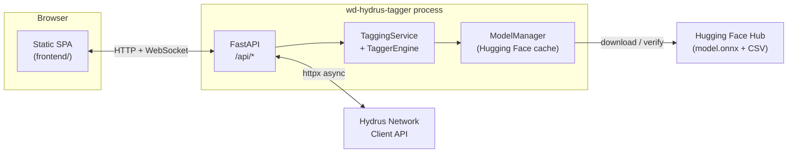
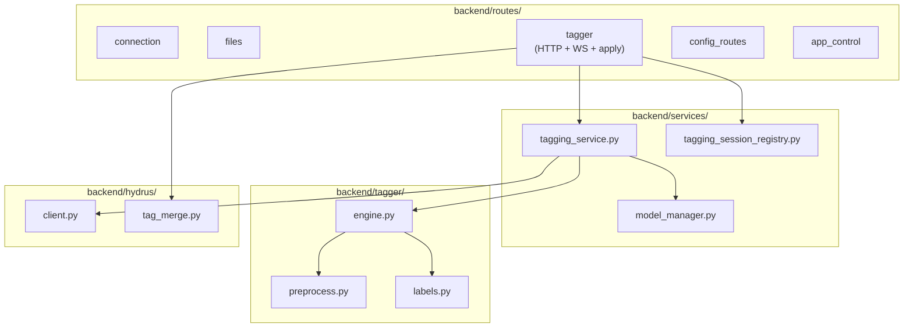
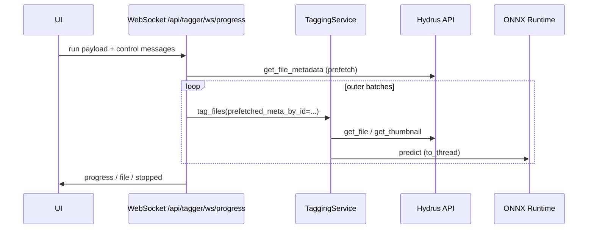

# Architecture overview

**wd-hydrus-tagger** is a small **FastAPI** application with a **vanilla JavaScript** single-page UI (no bundler). It connects to **Hydrus Network** over the Client API, runs **WD14 Tagger v3** models via **ONNX Runtime**, and streams batch-tagging progress over **WebSockets**.

This document summarizes core concepts, main components, data flow, and notable implementation choices.

---

## High-level system context

- **Browser**: gallery search, model selection, tagging session UI, settings (`PATCH /api/config`).
- **Server**: proxies Hydrus calls, runs inference, applies tags; serves static files from `frontend/` at `/`.
- **Hydrus**: source of file lists, thumbnails, full files, metadata, and tag storage.
- **Hugging Face**: optional download when models are missing or cache is invalid.

---

## Core concepts

| Concept | Role |
|--------|------|
| **WD14 Tagger v3** | Image classifiers (several backbones) that output Danbooru-style **general / character / rating** tag probabilities. Models ship as **ONNX** + **selected_tags.csv** (label index → category). |
| **TaggingService** | Singleton orchestrator: ensures model load, chunks Hydrus **metadata** fetches, parallel **image** fetches per batch, **`asyncio.to_thread`** for ONNX, formats tags with configurable prefixes, supports **marker-based skip** and **higher-tier model** skip logic. |
| **TaggerEngine** | Holds **`onnxruntime.InferenceSession`**, loads labels, runs **`preprocess_batch`** → inference → thresholded dicts per image. |
| **HydrusClient** | Async **httx** wrapper with a **pooled AsyncClient** per `(api_url, access_key)` for keep-alive under heavy parallel `get_file` / metadata traffic. |
| **WebSocket tagging session** | First JSON message starts a run (`file_ids`, thresholds, optional `batch_size`, `service_key`, `apply_tags_every_n`, `tag_all`, etc.); server prefetches metadata for the full queue, then processes **outer batches** with pause/resume/cancel/flush. |
| **Model markers (`wd14:…`)** | Optional tags record which WD model tagged a file; used to **skip re-inference** and to resolve **stale** markers when re-tagging with another model (`backend/hydrus/tag_merge.py`). |
| **AppConfig** | Pydantic-validated YAML; runtime patches via **`GET` / `PATCH /api/config`** (masked secrets toward the UI). |

---

## Layered structure

- **Routes** stay thin for HTTP concerns; heavy logic lives in **services** and **tag_merge**.
- **Frontend** (`frontend/js/`) uses a tiny pub/sub **`state.js`**, **`api.js`** for fetch wrappers, and components under **`components/`**.

---

## Main data flow (batch tagging)

1. **Connect**: credentials stored in `config.yaml`; **HydrusClient** pool key updates if URL/key change.
2. **Search / gallery**: `POST /api/files/search`, chunked **`get_file_metadata`** for thumbnails (`hydrus_metadata_chunk_size`).
3. **Load model**: disk cache under **`models_dir`**; HuggingFace download + **`.wd_model_cache.json`** manifest when needed.
4. **WebSocket run**: **`load_metadata_by_file_id`** once for all `file_ids` (prefetch), then each **`tag_files`** batch merges missing rows only.
5. **Per batch**: marker skip → parallel fetch (bounded) → **`TaggerEngine.predict`** in a worker thread → format tags → optional incremental **`add_tags`** when `apply_tags_every_n > 0`.
6. **Apply screen**: bulk **`POST /api/tagger/apply`** with deduplication against Hydrus **storage_tags**.

---

## Optimizations and “clever” sections

| Area | What it does |
|------|----------------|
| **ONNX `SessionOptions`** | Graph optimizations, configurable intra/inter threads, **`ORT_SEQUENTIAL`** with inter=1 for typical CPU batching, explicit **mem pattern / CPU arena**; CUDA provider first when `use_gpu`, else CPU EP. |
| **Batch tensor** | **`np.ascontiguousarray(..., float32)`** before `session.run` to reduce copies on some CPU builds. |
| **Non-blocking inference** | **`asyncio.to_thread(self.engine.predict, …)`** keeps the event loop responsive for WebSocket control and Hydrus I/O. |
| **Hydrus I/O** | Semaphore-limited parallel downloads; **video** paths prefer **thumbnail-only** to avoid multi-GB reads; full-file fallback to thumbnail when decode fails. |
| **Metadata prefetch** | Single prefetch over the full queue avoids repeating **`get_file_metadata`** every outer batch on large “tag all” runs. |
| **GC cadence** | **`gc.collect()`** every fourth inference batch (and once at end) trades a bit of retained RAM for fewer stop-the-world pauses than per-batch collection. |
| **httpx pool** | High **max_connections** / **keepalive** limits match parallel fetch + metadata + overlapping requests. |
| **Linux event loop** | Optional **uvloop** via `backend/runtime_linux.py` when the **`[perf]`** extra is installed. |
| **Stable `models_dir`** | **`stable_models_dir_for_config`** redirects temp/pytest cache paths to `<repo>/models` unless **`WD_TAGGER_ALLOW_TMP_MODELS_DIR=1`**, protecting ONNX disk cache lifetime. |
| **Perf logging** | **`perf_metrics.py`**: stdlib-only counters and single-line session/process summaries at boundaries (no hot-path overhead). |
| **Tag merge** | Normalized comparison of tags, **tier map** for model capability, pruning pending results to avoid redundant **`add_tags`**. |

---

## Supporting utilities

- **`backend/log_report.py`**: Summarizes log files (cache hits, Hydrus phases, errors) for operational debugging.
- **`backend/listen_hints.py`**: Prints LAN-friendly URLs on startup.
- **`backend/logging_setup.py`**: File logging, rotation hints, `latest` symlink behavior (see tests).
- **`scripts/check_requirements.py`** / **`wd-hydrus-tagger.sh`**: Pre-flight checks before run.

---

## Related docs

- **`docs/PERFORMANCE_AND_TUNING.md`** — knobs and behavior for large runs.
- **`docs/UPGRADE.md`** — dependency and batching upgrade notes.
- **`README.md`** — API ↔ UI map and configuration reference.
